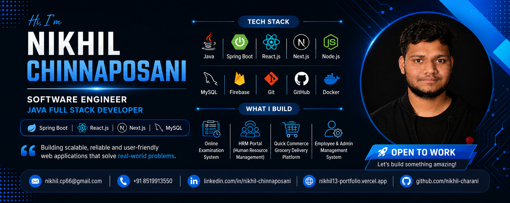

  

# Hi 👋, I'm Nikhil Chinnaposani

### Software Engineer | Java Full Stack Developer | Building Scalable Web Applications

---

## 🚀 About Me

💻 Passionate Software Engineer with hands-on experience in developing Full Stack Web Applications using Java, Spring Boot, React.js, Next.js, Node.js, MySQL, and Firebase.

🔹 Built multiple real-world applications including:

- 📝 Online Examination System
- 👨‍💼 HRM Portal
- 🛒 Hyperlocal Quick Commerce Platform
- 🏢 Employee & Admin Management System
- 🌐 Multiple Responsive Business Websites

🔹 Currently building a scalable Quick Commerce Grocery Delivery Platform using Microservices Architecture.

🔹 Strong foundation in OOP, DBMS, REST APIs, MVC Architecture, and System Design.

---

## 🎯 Current Focus

- Java Spring Boot Microservices
- Scalable Backend Architecture
- System Design
- Cloud Deployment
- Performance Optimization
- Enterprise Web Applications

---
## 🏅 Achievements

## 🛠️ Tech Stack

### Languages

### Frontend

### Backend

### Database

### Tools

---

# 💼 Featured Projects

## 📝 Online Examination System

Full-stack examination platform with:

✔ Student Registration

✔ Section-wise Exams

✔ Real-Time Evaluation

✔ Auto Scoring

✔ Result Management

### Tech Stack

Spring Boot • React.js • MySQL

Later upgraded using:

Next.js • Node.js • Firebase • Vercel

---

## 👨‍💼 HRM Portal

A centralized Human Resource Management System.

### Features

- Employee Onboarding
- Attendance Tracking
- Leave Management
- Payroll Processing
- Payslip Generation
- Role Based Access Control

### Tech Stack

React.js • Node.js • Firebase • Vercel

---

## 🛒 Hyperlocal Quick Commerce Platform

Currently Developing

### Modules

- User Management
- Admin Dashboard
- Delivery Partner Module
- Marketing Module
- Order Processing
- Authentication & Authorization

### Tech Stack

React.js

Java Microservices

MySQL

REST APIs

---

## 📊 GitHub Analytics

---

## 🔥 Contribution Streak

---

## 🏆 GitHub Trophies

<!-- 

 -->

## 🏅 Developer Profile

  
  

---

## 🐍 Contribution Snake

  

---

## 📈 Professional Highlights

✅ Java Full Stack Developer

✅ Spring Boot & React.js Specialist

✅ Built Real-Time Examination Platform

✅ Developed Enterprise HRM Portal

✅ Designing Microservices-Based Applications

✅ Strong Problem Solving & System Design Skills

---

## 🌐 Connect With Me

📧 Email: nikhil.cp66@gmail.com

💼 LinkedIn: https://linkedin.com/in/nikhil-chinnaposani

🌍 Portfolio: https://nikhil13-portfolio.vercel.app

🐙 GitHub: https://github.com/nikhil-charani

---
## 👀 Profile Views

  

---

### 🚀 "Turning Ideas Into Scalable Software Solutions"

